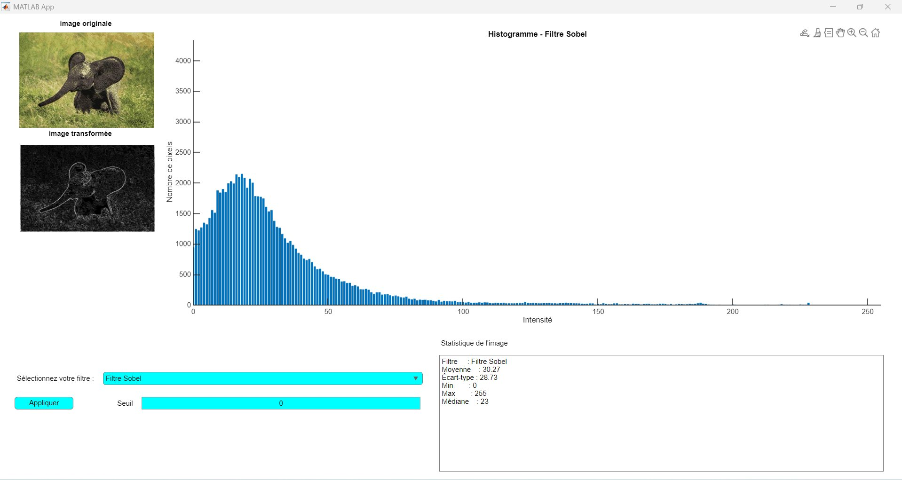

Application MATLAB créée avec App Designer. Elle permet de charger une image et d'appliquer différents filtres :


## Filtres disponibles
 

 
### 1. Gamma Correction
 
> Ce filtre change la luminosité de l'image. Avec `γ = 0.5`, l'image devient **plus claire**.
> Les zones sombres deviennent plus visibles.
 
**Formule :**
$$I_{out} = I_{in}^{\,\gamma}, \quad \gamma = 0.5$$
 
**Code MATLAB :**
```matlab
gamma = 0.5;
imgResult = im2uint8(imgDouble .^ gamma);
```
 
---
 
### 2. Transformation Exponentielle
 
> Ce filtre amplifie les **faibles intensités**. Les zones sombres deviennent plus claires.
> Les zones très lumineuses changent moins.
 
**Formule :**
$$I_{out} = \frac{e^{I_{in}} - 1}{\max(e^{I_{in}} - 1)}$$
 
**Code MATLAB :**
```matlab
imgExp = exp(imgDouble) - 1;
imgResult = im2uint8(imgExp / max(imgExp(:)));
```
 
---
 
### 3. Transformation Logarithmique
 
> Ce filtre compresse les **hautes intensités**. Il améliore le contraste dans les zones sombres.
> C'est l'inverse de la transformation exponentielle.
 
**Formule :**
$$I_{out} = \frac{\log(1 + I_{in})}{\max(\log(1 + I_{in}))}$$
 
**Code MATLAB :**
```matlab
imgLog = log(1 + imgDouble);
imgResult = im2uint8(imgLog / max(imgLog(:)));
```
 
---
 
### 4. Étirement Linéaire
 
> Ce filtre redistribue toutes les valeurs entre **0 et 255**.
> Il améliore le contraste global. Il utilise la valeur minimale et maximale de l'image.
 
**Formule :**
$$I_{out} = 255 \times \frac{I_{in} - I_{min}}{I_{max} - I_{min}}$$
 
**Code MATLAB :**
```matlab
minVal = double(min(ImageGray(:)));
maxVal = double(max(ImageGray(:)));
imgResult = uint8(255 * (double(ImageGray) - minVal) / (maxVal - minVal));
```
 
---
 
### 5. Égalisation d'Histogramme
 
> Ce filtre distribue les pixels **uniformément** sur toutes les intensités (0 à 255).
> L'histogramme devient presque plat. Le contraste est maximum.
 
**Formule :**
$$I_{out} = \text{CDF}(I_{in}) \times 255$$
 
> `CDF` = fonction de répartition cumulative de l'histogramme.
 
**Code MATLAB :**
```matlab
imgResult = histeq(ImageGray);
```
 
---
 
### 6. Filtre Sobel
 
> Ce filtre détecte les **contours** de l'image. Il calcule le gradient dans deux directions :
> horizontale (`Gx`) et verticale (`Gy`). Le résultat montre les bords de l'objet en blanc.
 
**Matrices de convolution :**
```
Gx = [-1  0  1]     Gy = [-1 -2 -1]
     [-2  0  2]           [ 0  0  0]
     [-1  0  1]           [ 1  2  1]
```
 
**Formule :**
$$\text{magnitude} = \sqrt{G_x^2 + G_y^2}$$
 
**Code MATLAB :**
```matlab
Gx = [-1 0 1; -2 0 2; -1 0 1];
Gy = [-1 -2 -1; 0 0 0; 1 2 1];
gradX = imfilter(double(ImageGray), Gx);
gradY = imfilter(double(ImageGray), Gy);
magnitude = sqrt(gradX.^2 + gradY.^2);
imgResult = uint8(255 * magnitude / max(magnitude(:)));
```
 
---
 
### 7. Méthode OTSU
 
> Ce filtre convertit l'image en **noir et blanc** (binarisation).
> Le seuil est calculé automatiquement par MATLAB. On peut aussi entrer un seuil manuellement (0–255).
 
**Formule :**
```
if I_in >= seuil:
    I_out = 255
else:
    I_out = 0
```
 
**Code MATLAB :**
```matlab
if app.seuilValue == 0
    seuil = graythresh(ImageGray);      % seuil automatique
else
    seuil = app.seuilValue / 255;       % seuil manuel
end
imgResult = uint8(imbinarize(ImageGray, seuil)) * 255;
```
 
---

## Prérequis pour l'installation

Avant de lancer l'application, vous devez installer **MATLAB Runtime R2024a**.

### Option 1 — Téléchargement automatique
Utilisez l'installateur dans le dossier `The App/for_redistribution` :
```
MyAppInstaller_web.exe
```
Il télécharge et installe le Runtime automatiquement.

### Option 2 — Téléchargement manuel
Téléchargez MATLAB Runtime R2024a depuis le site MathWorks :

👉 https://www.mathworks.com/products/compiler/mcr/index.html

> **Note :** Vous avez besoin des droits administrateur pour installer MATLAB Runtime.

---

## Installation et lancement

1. Clonez ce repository :
```bash
git clone https://github.com/ABDELHAKIM-IZIKI/Traitement-d-images-sous-MATLAB.git
```

2. Allez dans le dossier `The App/for_redistribution_files_only` :
```
MyFilter.exe
```

3. Lancez `MyFilter.exe`.

---

## Structure du The App 

```
The App/
│
├── for_redistribution/
│   └── MyAppInstaller_web.exe    # Installateur avec Runtime intégré
│
└── for_redistribution_files_only/
    ├── MyFilter.exe              # Application standalone
    ├── splash.png                # Écran de démarrage
    └── readme.txt                # Instructions en anglais
```

---

## Démonstration


*Exemple : application du Filtre Sobel sur une image d'éléphant — détection des contours avec histogramme et statistiques.*

---

## Utilisation

1. Lancez l'application `MyFilter.exe`
2. Cliquez sur **l'image originale** pour charger une image (`.jpg`, `.png`, `.jpeg`)
3. Sélectionnez un filtre dans le menu déroulant
4. Entrez une valeur de seuil si nécessaire (pour OTSU)
5. Cliquez sur **Appliquer**
6. Consultez l'histogramme et les statistiques

---

## Technologies utilisées

- **MATLAB R2024a**
- **MATLAB App Designer**
- **MATLAB Compiler** (déploiement standalone)

---
